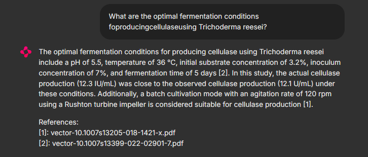

# MEPAM
a evidence-based Question-Answering system：Microbial Enzyme Production and Catalytic Activit
## Effect Diagram

## Before using the QAsystem
Please download the QAsystem:
```bash
wget -O MEPAM_QA.tar "https://example.com/path/to/MEPAM_QA.tar"
```
## Technical Architecture
MEPAM_NER:Named Entity Recognition based on OntoGPT
MEPAM_QA：Question-Answering System based on GraphRAG
## Quick Start
## MEPAM_NER
You can quickly build a knowledge graph using MEPAM_NER. If you only need to use the QA system, you can skip to the MEPAM_QA section.
### 1. Environment Configuration
```bash
conda env create -f environment.yaml
conda activate ner
poetry install
```
Before running the code, please set your API key and basic settings in the INI file. You can also save your API key in the .env file or set it using export:
 ```bash
export OPENAI_API_KEY=your_api_key_here 
 ```
1.1 Install the Evaluation Model ollama/qwen2.5:14b
```bash
export OLLAMA_MIRROR="https://ghproxy.cn/https://github.com/ollama/ollama/releases/latest/download"
curl -fsSL https://ollama.com/install.sh | sed "s|https://ollama.com/download|$OLLAMA_MIRROR|g" | sh
ollama run qwen2.5:14b
```
### 2. Triple Extraction
2.1 Extract Information from PDFs

```bash
python MEPAM_NER/scripts/grobid_pdf2csv.py MEPAM_NER/scripts/pdf2txt.ini
python MEPAM_NER/scripts/cermine_pdf2csv.py MEPAM_NER/scripts/pdf2txt.ini
python MEPAM/MEPAM_NER/scripts/combine.py
 ```
2.2 Evaluate the Accuracy of PDF Extraction
Please modify the INI configuration before use:
```bash
python MEPAM_NER/scripts/parse_metric.py MEPAM_NER/scripts/pdf2txt.ini
 ```
#### Before extraction, please download the corresponding literature according to the list in data/100txtlist.xlsx for testing.

2.3 Extract Triples Using LinkML
```bash
bash MEPAM_NER/scripts/LinkML.sh
```
2.4 Extract Triples Using NonLinkML
```bash
python MEPAM_NER/scripts/getjson.py --input_folder MEPAM_NER/data/100txt/ --output_folder data/nonlinkml/qwen/  --api_key your_api_key_here --model openai/qwen2.5-72b-instruct --base_url https://dashscope.aliyuncs.com/compatible-mode/v1 
```
2.5 Evaluate the Results
```bash
python MEPAM_NER/scripts/ner_metric.py ner_metric.ini
```
####In the data directory, we have saved the results of LinkML, NonLinkML, and manual extraction for 100 articles, as well as the final evaluation results.
### 3. Using the QA System
3.1 Start the Ollama Service
```bash
cd MEPAM_QA/ollama
sh start_service.sh
```
Verify if the Ollama service is running:
Enter http://your_IP:11434 in your browser's address bar to check if "Ollama is running" is displayed.
3.2 Start Nebula Graph
```bash
cd
cd nebula/nebula-graph-3.8
docker-compose up -d
```
3.3 Start Nebula Graph Console
```bash
cd nebula-graph-studio-3.10.0
docker-compose up -d
```
You can log in via http://your_IP:7001/. The default username is root and the password is 12345678.
3.4 Confirm if the Data Index Exists
Vertex index: If it exists, skip the next step of index creation.
If it does not exist, please manually create the vertex index.
After creation, execute rebuild.
3.5 Check if the Edge Index Exists
If it exists, skip the next step of index creation.
If it does not exist, please manually create the edge index.
After creation, execute rebuild.
3.5 Chatbot Service
```bash
cd enzyme-rag-server
```
Modify app/config.yaml to change the address to the IP of the machine where Nebula and Ollama are deployed.
```bash
sh start_service.sh
docker ps | grep enzyme_rag_server
```
You can log in via http://your_IP:8000/. The default username is admin and the password is admin.
#### When server resources are limited, there may be unresponsive issues. Please check for times out errors using docker logs enzyme_rag_server and ensure sufficient server resources before proceeding.
